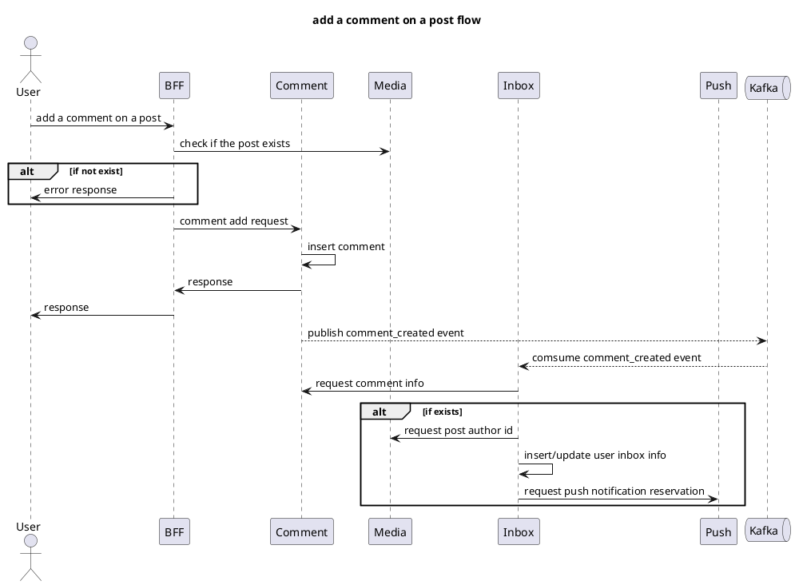
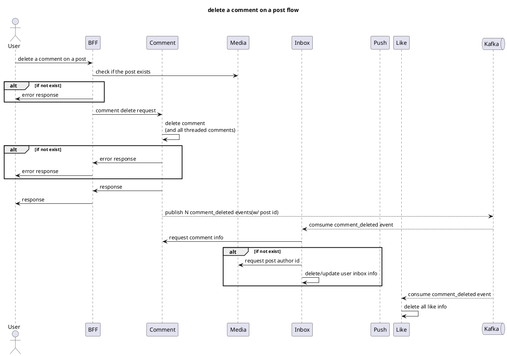
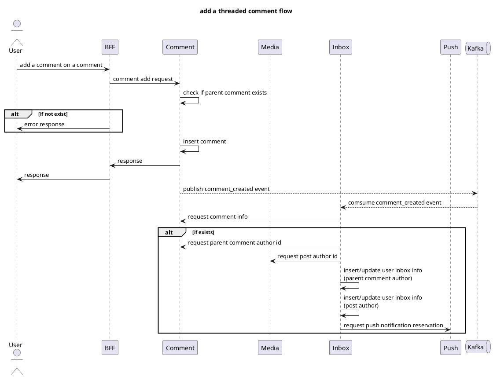
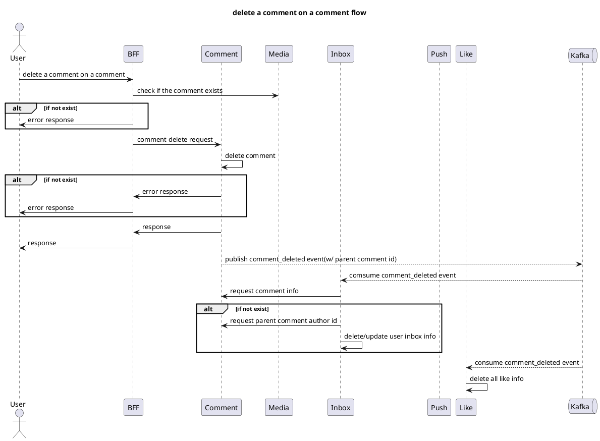

# Comment sequence diagrams

## Add comment on post flow

```plantuml:add-comment-on-post-flow
@startuml
title "add a comment on a post flow"

actor User as user
participant BFF as bff
participant Comment as comment
participant Media as media
participant Inbox as inbox
participant Push as push
queue Kafka as kafka

user -> bff: add a comment on a post
bff -> media: check if the post exists
alt if not exist
user <- bff: error response
end
bff -> comment: comment add request
comment -> comment: insert comment
bff <- comment: response
user <- bff: response
comment --> kafka: publish comment_created event
kafka --> inbox: comsume comment_created event
inbox -> comment: request comment info
alt if exists
inbox -> media: request post author id
inbox -> inbox: insert/update user inbox info
inbox -> push: request push notification reservation
end
@enduml
```

## Delete comment on post flow

```plantuml:delete-comment-on-post-flow
@startuml
title "delete a comment on a post flow"

actor User as user
participant BFF as bff
participant Comment as comment
participant Media as media
participant Inbox as inbox
participant Push as push
participant Like as like
queue Kafka as kafka

user -> bff: delete a comment on a post
bff -> media: check if the post exists
alt if not exist
user <- bff: error response
end
bff -> comment: comment delete request
comment -> comment: delete comment\n(and all threaded comments)
alt if not exist
bff <- comment: error response
user <- bff: error response
end
bff <- comment: response
user <- bff: response
comment --> kafka: publish N comment_deleted events(w/ post id)
kafka --> inbox: comsume comment_deleted event
inbox -> comment: request comment info
alt if not exist
inbox -> media: request post author id
inbox -> inbox: delete/update user inbox info
end
like <-- kafka: consume comment_deleted event
like -> like: delete all like info
@enduml
```

## Add comment on comment flow

```plantuml:add-comment-on-comment-flow
@startuml
title "add a threaded comment flow"

actor User as user
participant BFF as bff
participant Comment as comment
participant Media as media
participant Inbox as inbox
participant Push as push
queue Kafka as kafka

user -> bff: add a comment on a comment
bff -> comment: comment add request
comment -> comment: check if parent comment exists
alt if not exist
user <- bff: error response
end
comment -> comment: insert comment
bff <- comment: response
user <- bff: response
comment --> kafka: publish comment_created event
kafka --> inbox: comsume comment_created event
inbox -> comment: request comment info
alt if exists
inbox -> comment: request parent comment author id
inbox -> media: request post author id
inbox -> inbox: insert/update user inbox info\n(parent comment author)
inbox -> inbox: insert/update user inbox info\n(post author)
inbox -> push: request push notification reservation
end
@enduml
```

## Delete comment on comment flow

```plantuml:delete-comment-on-comment-flow
@startuml
title "delete a comment on a comment flow"

actor User as user
participant BFF as bff
participant Comment as comment
participant Media as media
participant Inbox as inbox
participant Push as push
participant Like as like
queue Kafka as kafka

user -> bff: delete a comment on a comment
bff -> media: check if the comment exists
alt if not exist
user <- bff: error response
end
bff -> comment: comment delete request
comment -> comment: delete comment
alt if not exist
bff <- comment: error response
user <- bff: error response
end
bff <- comment: response
user <- bff: response
comment --> kafka: publish comment_deleted event(w/ parent comment id)
kafka --> inbox: comsume comment_deleted event
inbox -> comment: request comment info
alt if not exist
inbox -> comment: request parent comment author id
inbox -> inbox: delete/update user inbox info
end
like <-- kafka: consume comment_deleted event
like -> like: delete all like info
@enduml
```

