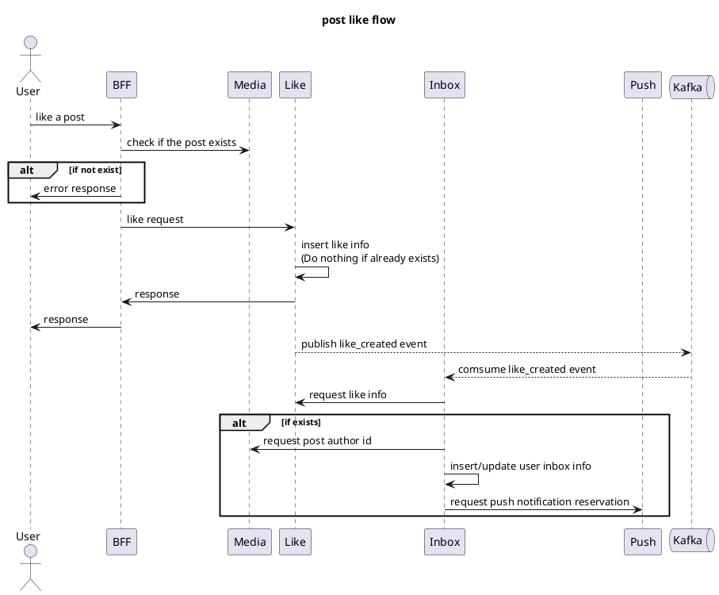
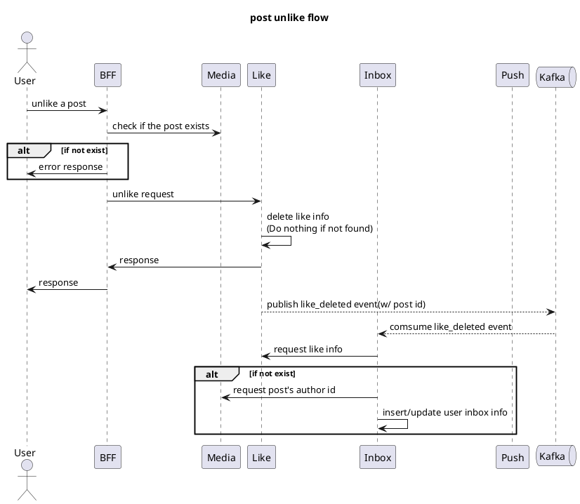
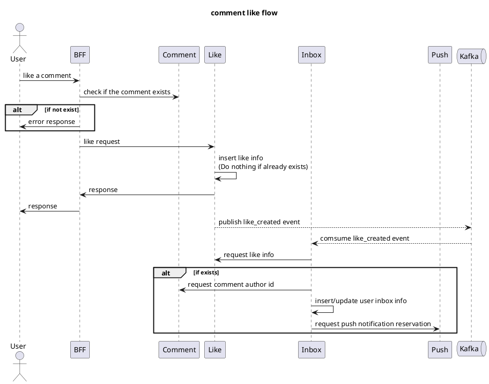
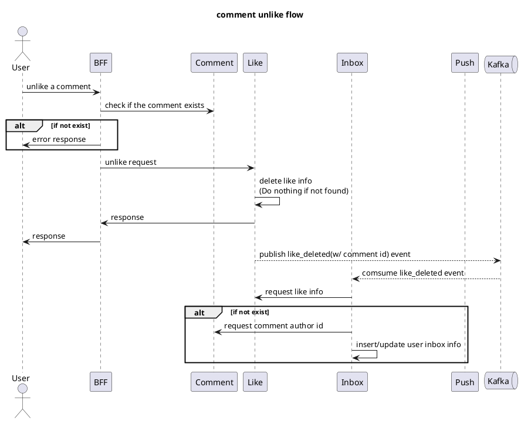

# Like sequence diagrams

## Post like flow

    
UML

```plantuml:post-like-flow
@startuml
title "post like flow"

actor User as user
participant BFF as bff
participant Media as media
participant Like as like
participant Inbox as inbox
participant Push as push
queue Kafka as kafka

user -> bff: like a post
bff -> media: check if the post exists
alt if not exist
user <- bff: error response
end
bff -> like: like request
like -> like: insert like info\n(Do nothing if already exists)
bff <- like: response
user <- bff: response
like --> kafka: publish like_created event
kafka --> inbox: comsume like_created event
inbox -> like: request like info
alt if exists
inbox -> media: request post author id
inbox -> inbox: insert/update user inbox info
inbox -> push: request push notification reservation
end
@enduml
```

## Post unlike flow

    
UML

```plantuml:post-unlike-flow
@startuml
title "post unlike flow"

actor User as user
participant BFF as bff
participant Media as media
participant Like as like
participant Inbox as inbox
participant Push as push
queue Kafka as kafka

user -> bff: unlike a post
bff -> media: check if the post exists
alt if not exist
user <- bff: error response
end
bff -> like: unlike request
like -> like: delete like info\n(Do nothing if not found)
bff <- like: response
user <- bff: response
like --> kafka: publish like_deleted event(w/ post id)
kafka --> inbox: comsume like_deleted event
inbox -> like: request like info
alt if not exist
inbox -> media: request post's author id
inbox -> inbox: insert/update user inbox info
end
@enduml
```

## Comment like flow

    
UML

```plantuml:comment-like-flow
@startuml
title "comment like flow"

actor User as user
participant BFF as bff
participant Comment as comment
participant Like as like
participant Inbox as inbox
participant Push as push
queue Kafka as kafka

user -> bff: like a comment
bff -> comment: check if the comment exists
alt if not exist
user <- bff: error response
end
bff -> like: like request
like -> like: insert like info\n(Do nothing if already exists)
bff <- like: response
user <- bff: response
like --> kafka: publish like_created event
kafka --> inbox: comsume like_created event
inbox -> like: request like info
alt if exists
inbox -> comment: request comment author id
inbox -> inbox: insert/update user inbox info
inbox -> push: request push notification reservation
end
@enduml
```

## Comment unlike flow

    
UML

```plantuml:comment-unlike-flow
@startuml
title "comment unlike flow"

actor User as user
participant BFF as bff
participant Comment as comment
participant Like as like
participant Inbox as inbox
participant Push as push
queue Kafka as kafka

user -> bff: unlike a comment
bff -> comment: check if the comment exists
alt if not exist
user <- bff: error response
end
bff -> like: unlike request
like -> like: delete like info\n(Do nothing if not found)
bff <- like: response
user <- bff: response
like --> kafka: publish like_deleted(w/ comment id) event
kafka --> inbox: comsume like_deleted event
inbox -> like: request like info
alt if not exist
inbox -> comment: request comment author id
inbox -> inbox: insert/update user inbox info
end
@enduml
```

